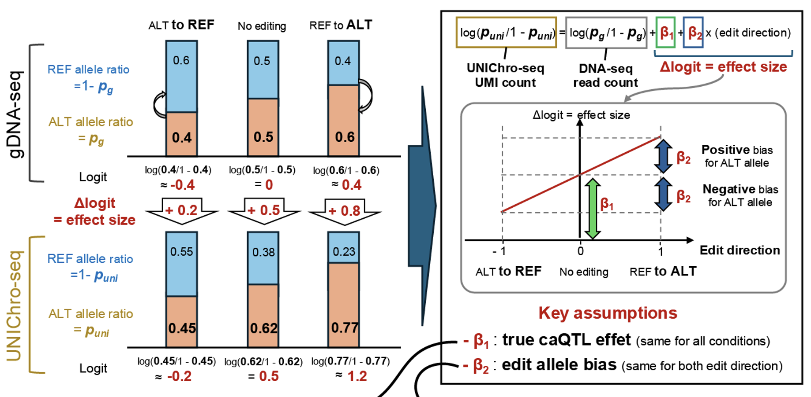

# UNIChro-seq-Analysis

This repository provides analysis scripts used in the UNIChro-seq paper(in preparation).

## Folder Structure

- **`Unichro-seq-pipeline/`**  
  - **`ATAC-seq/`**  
    - **`script/`**: Contains scripts related to preprocessing and analyzing ATAC-seq data.
    - `workflow.sh`: Workflow script for ATAC-seq analysis.
  - **`DNA-seq/`**  
    - **`script/`**: Contains scripts related to preprocessing and analyzing DNA-seq data.
    - `workflow.sh`: Workflow script for DNA-seq analysis.
      
- **`crisper_analysis/`**  
  - **`CRISPResso2/`**: Contains scripts for analysis using CRISPResso2.
  - **`bidirectional_edit_demo/`**: Contains a demo of bidirectional editing.
    - `README.md`: Documentation for the demo.
    - `bidirectional_analysis.R`: R script for bidirectional analysis.
    - `input_file.txt`: input file example
    - `result.txt`: analysis result example

- **`bulk_analysis/`**  
  - **`bulk_ATAC-seq/`**: Contains scripts for bulk ATAC-seq data analysis.
  - **`bulk_RNA-seq/`**: Contains scripts for bulk RNA-seq data analysis.
    
## Bidirectional Editing Demo

The [`crisper_analysis/bidirectional_edit_demo/`](./crisper_analysis/bidirectional_edit_demo/) directory includes a demonstration of bidirectional editing analysis. This showcases the implementation of bidirectional genome editing to control for allele-specific biases. For detailed information, please refer to the `README.md` within the respective directory.

