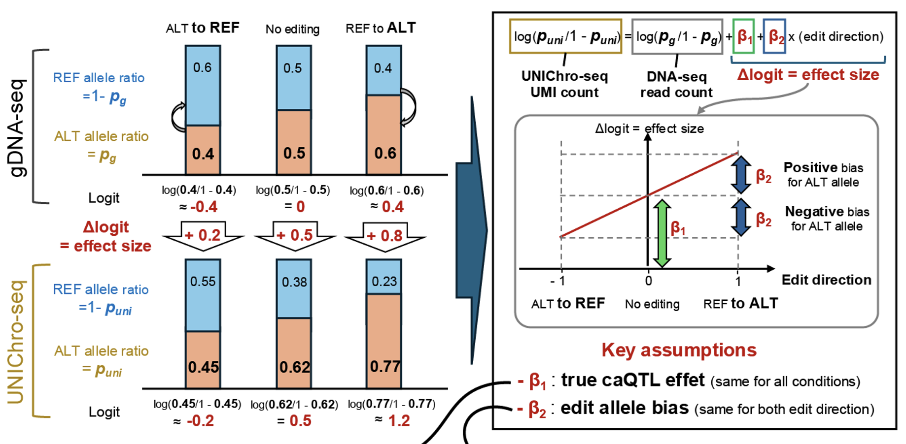
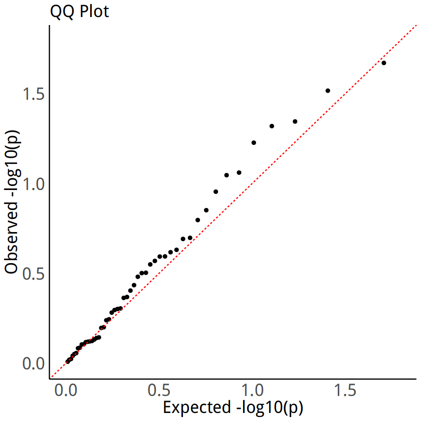

# UNIChro-seq Bidirectional Analysis Demo



This demo-script identifies caQTLs and editing biases using a generalized linear mixed model that combines UMI-counted ATAC-seq read counts and DNA-seq ALT/(REF+ALT) ratios, both analyzed with allele-specific probes.

## Usage

### Running the Script
```bash
Rscript bidirectional_analysis.R --input input_file.txt --output results.txt
```

### Command-line Arguments
| Argument | Description |
|----------|-------------|
| `--input` | Path to the input text file |
| `--output` | Path to the output text file |

### Interactive Usage in R
The script can also be used interactively by sourcing it in an R session:

```R
# Source the script
source("bidirectional_analysis.R")

# Read your data
input_file<-"path/to/input_file.txt"
data <- read.table(input_file, header = TRUE, sep = "\t", stringsAsFactors = FALSE)

# Run the analysis
results <- run_analysis(data)

# Write results to file
write_results(results, "path/to/results.txt")
```

## Expected Input Format (`input_file.txt`)
The script expects an tab-separated input file with the following required columns:

| Donor | edit_direction | SNP | ref | alt | REF_count | ALT_count |
|--------|---------------|-----|-----|-----|-----------|-----------| 
| S01 | ALT_to_REF | rs35320439 | 3906 | 1444 | 126142 | 82049 |
| S01 | NON_EDIT | rs35320439 | 2830 | 1909 | 59753 | 74000 |
| S01 | REF_to_ALT | rs35320439 | 2209 | 4824 | 40315 | 121156 |
| S02 | ALT_to_REF | rs35320439 | 1877 | 914 | 127783 | 93972 |
| S02 | NON_EDIT | rs35320439 | 1767 | 1211 | 86939 | 96592 |
| S02 | REF_to_ALT | rs35320439 | 1183 | 2225 | 43846 | 114868 |
| S03 | ALT_to_REF | rs35320439 | 1954 | 1046 | 79038 | 67799 |

### Column Descriptions
* `Donor`: Unique identifier for the Donor
* `edit_direction`: Editing direction (`REF_to_ALT`, `ALT_to_REF`, or `NON_EDIT`)
* `SNP`: SNP ID
* `ref`: Reference allele read count from ATAC-seq
* `alt`: Alternative allele read count from ATAC-seq
* `REF_count`: Reference allele read count from DNA-seq
* `ALT_count`: Alternative allele read count from DNA-seq

## Output Format (`results.txt`)
The script generates an output file containing the results of the GLMM analysis in the following format:

| SNP | effect_type | Effect_size | SE | p_value |
|-----|---------|-----------|------------|----------|
| rs35320439 | caQTL | -0.339 | 0.041 | 9.14E-17 |
| rs35320439 | toALT_edit_bias | 0.106 | 0.018  | 8.62E-09 |

### Output Column Descriptions
* `SNP`: The SNP ID being analyzed
* `effect_type`: The type of effect
  * `caQTL`: caQTL effect (positive values indicate higher chromatin accessibility for ALT allele)
  * `toALT_edit_bias`: Edit bias effect (positive values indicate bias towards ALT allele)
* `Effect_size`: The magnitude and direction of the effect in log-odds scale
* `SE`: Standard error of the effect size
* `p_value`: Significance value of the effect size

## Implementation Details

### Required R Libraries
The script relies on the following R packages:

```R
library(dplyr)
library(tidyr)
library(lme4)
library(lmerTest)
library(ggplot2)
```

### GLMM Model
The script applies a generalized linear mixed model (GLMM) with a binomial family:

```R
model <- glmer(refalt ~ offset(logit(ALT_dna_prob)) + toALT_edit_bias + 
                          (1 + toALT_edit_bias | Donor),
                          family = binomial, data = long_DF)
```

# Permutation Analysis of edit direction


A Jupyter notebook for permutation analysis is also available in this repository: [bi-directional_editing_demo_permutation.ipynb](bi-directional_editing_demo_permutation.ipynb). The notebook implements permutation tests to assess the statistical significance of allelic editing biases observed in the data. By randomly shuffling edit direction labels and comparing to actual results, these tests validate whether the observed edit biases (REF_to_ALT or ALT_to_REF) represent genuine biological phenomena rather than random variation. The QQ plot above illustrates the distribution of permutation test p-values against expected values under the null hypothesis.

## Notes
* Ensure the input file is formatted correctly with tab-separated values.
* In this analysis, technical replicates were summed before processing.
* GLMM p-values may slightly vary on different computing platforms and numerical libraries.

## Session Info
R version 4.1.3 (2022-03-10)
Platform: x86_64-conda-linux-gnu (64-bit)
Running under: Red Hat Enterprise Linux 8.8 (Ootpa)

Matrix products: default
BLAS/LAPACK: [conda environment library path]/libopenblasp-r0.3.21.so

locale:
 [1] LC_CTYPE=ja_JP.UTF-8       LC_NUMERIC=C              
 [3] LC_TIME=ja_JP.UTF-8        LC_COLLATE=ja_JP.UTF-8    
 [5] LC_MONETARY=ja_JP.UTF-8    LC_MESSAGES=ja_JP.UTF-8   
 [7] LC_PAPER=ja_JP.UTF-8       LC_NAME=C                 
 [9] LC_ADDRESS=C               LC_TELEPHONE=C            
[11] LC_MEASUREMENT=ja_JP.UTF-8 LC_IDENTIFICATION=C       

attached base packages:
[1] stats     graphics  grDevices utils     datasets  methods   base     

other attached packages:
[1] lmerTest_3.1-3 lme4_1.1-35.4  Matrix_1.6-5   tidyr_1.3.1    dplyr_1.1.4   

loaded via a namespace (and not attached):
 [1] Rcpp_1.0.12         nloptr_1.2.2.3      pillar_1.9.0       
 [4] compiler_4.1.3      base64enc_0.1-3     tools_4.1.3        
 [7] boot_1.3-30         digest_0.6.35       uuid_1.2-0         
[10] gtable_0.3.5        jsonlite_1.8.8      evaluate_0.24.0    
[13] lifecycle_1.0.4     tibble_3.2.1        nlme_3.1-165       
[16] lattice_0.22-6      pkgconfig_2.0.3     rlang_1.1.4        
[19] IRdisplay_1.1       cli_3.6.3           IRkernel_1.3.2     
[22] fastmap_1.2.0       withr_3.0.0         repr_1.1.7         
[25] generics_0.1.3      vctrs_0.6.5         grid_4.1.3         
[28] tidyselect_1.2.1    glue_1.7.0          R6_2.5.1           
[31] fansi_1.0.6         minqa_1.2.7         pbdZMQ_0.3-11      
[34] ggplot2_3.5.1       purrr_1.0.2         magrittr_2.0.3     
[37] scales_1.3.0        htmltools_0.5.8.1   splines_4.1.3      
[40] MASS_7.3-60.0.1     colorspace_2.1-0    numDeriv_2016.8-1.1
[43] utf8_1.2.4          munsell_0.5.1       crayon_1.5.3       

## License
This project is licensed under the MIT License.
