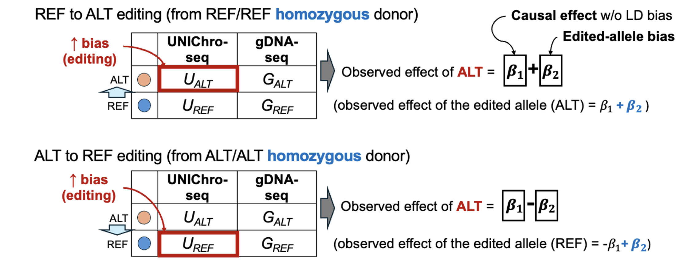

# UNIChro-seq Uni-directional Analysis Demo



This demo-script identifies caQTLs from homozygous samples (REF/REF or ALT/ALT) using a generalized linear mixed model that combines UMI-counted ATAC-seq read counts and DNA-seq ALT/(REF+ALT) ratios, both analyzed with allele-specific probes.

## Usage

### Running the Script
```bash
Rscript uni-directional_analysis.R --input input_file --output output_file
```

### Command-line Arguments
| Argument | Description |
|----------|-------------|
| `--input` | Path to the input text file |
| `--output` | Path to the output text file |

### Interactive Usage in R
The script can also be used interactively by sourcing it in an R session:

```R
# Source the script
source("uni-directional_analysis.R")

# Read your data
input_file<-"path/to/input_file"
data <- read.table(input_file, header = TRUE, sep = "\t", stringsAsFactors = FALSE)

# Run the analysis
results <- run_analysis(data)

write_results(results, "path/to/output_file")
```

## Expected Input Format (`input_file_REF_to_ALT.txt`)
The script expects an tab-separated input file with the following required columns:

| Donor | SNP | NON_EDITED_DNA_count | EDITED_DNA_count | non_edited_atac_count | edited_atac_count |
|------|------|------|------|------|------|
| S01 | rs58107865 | 36617 | 11783 | 9104 | 5451 |
| S02 | rs58107865 | 41940 | 23141 | 8561 | 10115 |
| S03 | rs58107865 | 84216 | 29079 | 9469 | 6184 |
| S04 | rs58107865 | 45385 | 12462 | 3739 | 1871 |
| S05 | rs58107865 | 37834 | 4828 | 11363 | 2365 |

### Column Descriptions
* `Donor`: Unique identifier for the Donor
* `SNP`: SNP ID
* `NON_EDITED_DNA_count`: NON_EDITED allele(In case of REF_to_ALT editing from REF-homo donors, ALT) read count from DNA-seq
* `EDITED_DNA_count`: EDITED allele(In case of REF_to_ALT editing from REF-homo donors, REF) read count from DNA-seq
* `non_edited_atac_count`: non_edited allele(In case of REF_to_ALT editing from REF-homo donors, ALT) read count from ATAC-seq
* `edited_atac_count`: edited_allele(In case of REF_to_ALT editing from REF-homo donors, REF) read count from ATAC-seq

## Output Format (`results_REF_to_ALT.txt`)
The script generates an output file containing the results of the GLMM analysis in the following format:

| SNP | Effect_size | SE | p_value |
|-----|-----------|------------|----------|
| rs58107865 | 0.623070912099292 | 0.0388983763436045 | 9.58083459593302e-58 |

### Output Column Descriptions
* `SNP`: The SNP ID being analyzed
* `Effect_size`: The magnitude and direction of the effect in log-odds scale
* `SE`: Standard error of the effect size
* `p_value`: Significance value of the effect size

## Implementation Details

### Required R Libraries
The script relies on the following R packages:

```R
library(dplyr)
library(tidyr)
library(lme4)
library(lmerTest)
library(ggplot2)
```

### GLMM Model
The script applies a generalized linear mixed model (GLMM) with a binomial family:

```R
  model <- glmer(edit_type ~ offset(logit(EDITED_DNA_prob)) + (1 | Donor),
                 family = binomial, data = long_DF)
```
Where:

`EDITED_DNA_prob = EDITED_DNA_count / (NON_EDITED_DNA_count + EDITED_DNA_count)`

## Notes
* Ensure the input file is formatted correctly with tab-separated values.
* In this analysis, technical replicates were summed before processing.
* GLMM p-values may slightly vary on different computing platforms and numerical libraries.

## Session Info
R version 4.2.1 (2022-06-23)
Platform: x86_64-conda-linux-gnu (64-bit)
Running under: Red Hat Enterprise Linux 8.8 (Ootpa)

Matrix products: default
BLAS/LAPACK: /home/ha7477/tools/miniconda3/envs/de/lib/libopenblasp-r0.3.21.so

locale:
 [1] LC_CTYPE=ja_JP.UTF-8       LC_NUMERIC=C              
 [3] LC_TIME=ja_JP.UTF-8        LC_COLLATE=ja_JP.UTF-8    
 [5] LC_MONETARY=ja_JP.UTF-8    LC_MESSAGES=ja_JP.UTF-8   
 [7] LC_PAPER=ja_JP.UTF-8       LC_NAME=C                 
 [9] LC_ADDRESS=C               LC_TELEPHONE=C            
[11] LC_MEASUREMENT=ja_JP.UTF-8 LC_IDENTIFICATION=C       

attached base packages:
[1] stats     graphics  grDevices utils     datasets  methods   base     

other attached packages:
[1] ggplot2_3.5.1  lmerTest_3.1-3 lme4_1.1-35.3  Matrix_1.6-5   tidyr_1.3.1   
[6] dplyr_1.1.4   

loaded via a namespace (and not attached):
 [1] Rcpp_1.0.12         nloptr_2.0.3        pillar_1.9.0       
 [4] compiler_4.2.1      base64enc_0.1-3     tools_4.2.1        
 [7] boot_1.3-30         digest_0.6.36       uuid_1.2-0         
[10] gtable_0.3.5        jsonlite_1.8.8      evaluate_0.24.0    
[13] lifecycle_1.0.4     tibble_3.2.1        nlme_3.1-160       
[16] lattice_0.22-6      pkgconfig_2.0.3     rlang_1.1.4        
[19] IRdisplay_1.1       cli_3.6.3           IRkernel_1.3.2     
[22] fastmap_1.2.0       withr_3.0.0         repr_1.1.7         
[25] generics_0.1.3      vctrs_0.6.5         grid_4.2.1         
[28] tidyselect_1.2.1    glue_1.7.0          R6_2.5.1           
[31] fansi_1.0.6         minqa_1.2.5         pbdZMQ_0.3-11      
[34] purrr_1.0.2         magrittr_2.0.3      scales_1.3.0       
[37] htmltools_0.5.8.1   splines_4.2.1       MASS_7.3-60.0.1    
[40] colorspace_2.1-0    numDeriv_2016.8-1.1 utf8_1.2.4         
[43] munsell_0.5.1       crayon_1.5.3    
